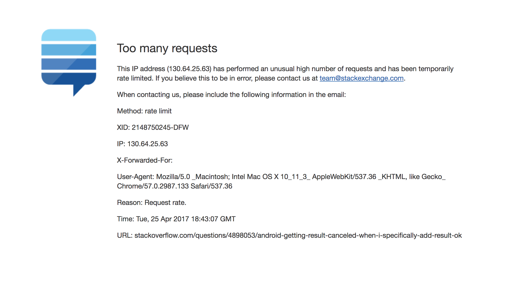

#Repository for Michelle Luo (mluo02) for Comp20
This repository is a collection of assignments for Comp 20 at Tufts University.
My favorite assignment of this semester was probably working on the server for "Not Uber" - the Black Car Service.

I've grown a lot in taking this course: because web is so pervasive these days, I feel like I have a greater understanding of what's actually happening behind the scenes whenever I try to get on a website. Before this course, I knew basic HTML/CSS and all I knew about web servers was that they're special computers that serve stuff.

One of the most important things I've learned in this course isn't necessarily strictly related to the assignments and labs--after working with the Spotify API (for the semester project) and the Twitter API (which I explored for another class), I learned to read documentation in a much quicker and more efficient manner. Basically, I learned how to ask the people around me (friends, professors, TAs, the Internet, Stack Overflow) for help in furthering my learning: my friends and I learned a lot from each other when working on the semester project. 
While doing assignment 4, I read a lot of interesting articles about XSS attacks and database injection and just how common they are. I'm glad I learned about these topics a little bit in this course, but I wish that they were also briefly discussed in the intro level CS courses here.

Finally, I also learned what this glorious response I got last week means:

I'm really looking forward to security next semester, and in the future I'd like to try to look more into (non-Javascript-based) server-side frameworks and server software.